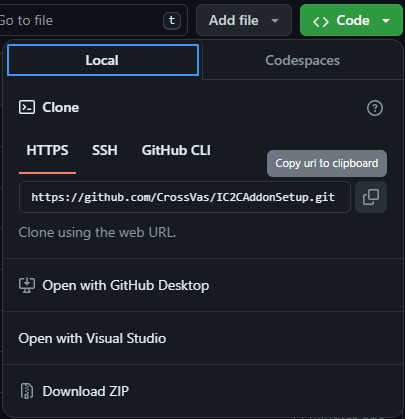

Setup Process:
==============================

Step 1: Fork this repository

Step 2: Open command-line and type the following command to clone the repository 'git clone `repository adress`' - usually you get this by clicking on `Code`, in your case the username won't be `CrossVas`, but your.

Step 3: You're left with a choice.

If you prefer to use Eclipse:
1. Run the following command: `./gradlew genEclipseRuns`
2. Open Eclipse, Import > Existing Gradle Project > Select Folder 
   or run `gradlew eclipse` to generate the project.

If you prefer to use IntelliJ:
1. Right-click on the newly cloned folder and select `Open Folder as IntellIj IDEA Project`
2. IntelliJ IDEA will do the rest, just wait.
3. To run the project, head to Gradle menu on the right side, select `Tasks/forgegradle runs` and then `runClient`

If at any point you are missing libraries in your IDE, or you've run into problems you can 
run `gradlew --refresh-dependencies` to refresh the local cache. `gradlew clean` to reset everything 
{this does not affect your code} and then start the process again.
